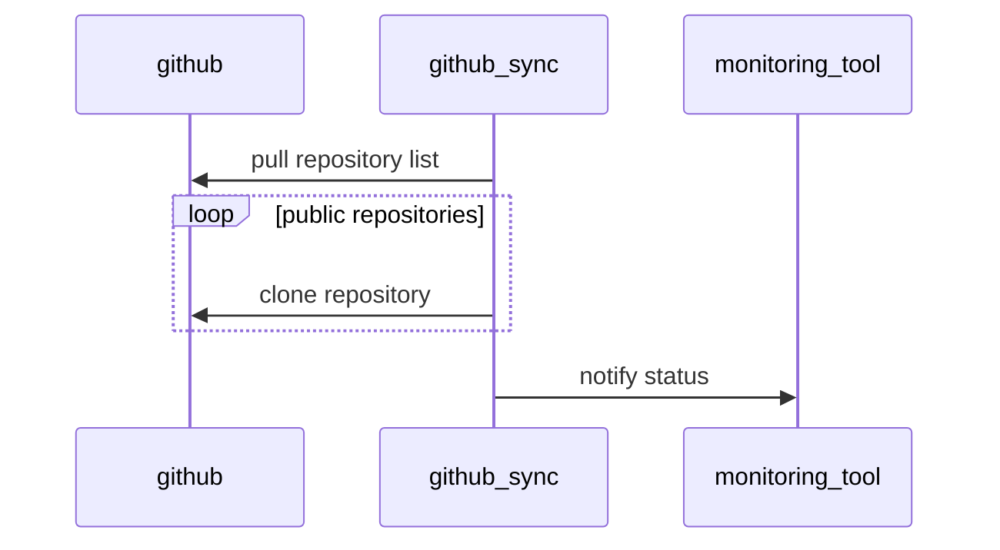

# Github sync

A handy script for backupping public repos from a github account :) (it's just my fear of loosing data :c ).

## Why this

**DO BACKUPS!!** this is what as been told to me since i started doing system administration tasks and projects. So i wrote this script moved by the fear of losing github repositories (as if my hard drives were more reliable than microsoft ones), originally designed to run as a cron job.

Recently i have migrated my homelab services to a configuration managed with ansible and terraform and i found myself dealing with a lot of scripts like this one that were not designed to be ported from a machine to another and the idea comes to mind:

*What if i put a cron script inside a docker container?*

and this abomination was born :)

## How it works

The script runs as a `cron` job, it fetches the github api to download the list of public repos and downloads them, then it curls the configured monitoring api.



## Installation

Installation is done trough docker container a sample can be as follows

```yaml
services:
  github_sync:
    container_name: github_sync
    image: carnivuth/github_sync:latest
    environment:
      HEALTHCHECK: "[HEALTHCHECKS.IO URL]"
      NTFY: "[NTFY URL]"
      ACCOUNT: "[GITHUB USERNAME TO BACKUP]"
    volumes:
      - "<data folder>:/var/lib/github_sync"
      - "/etc/timezone:/etc/timezone:ro"
      - "/etc/localtime:/etc/localtime:ro"
```
